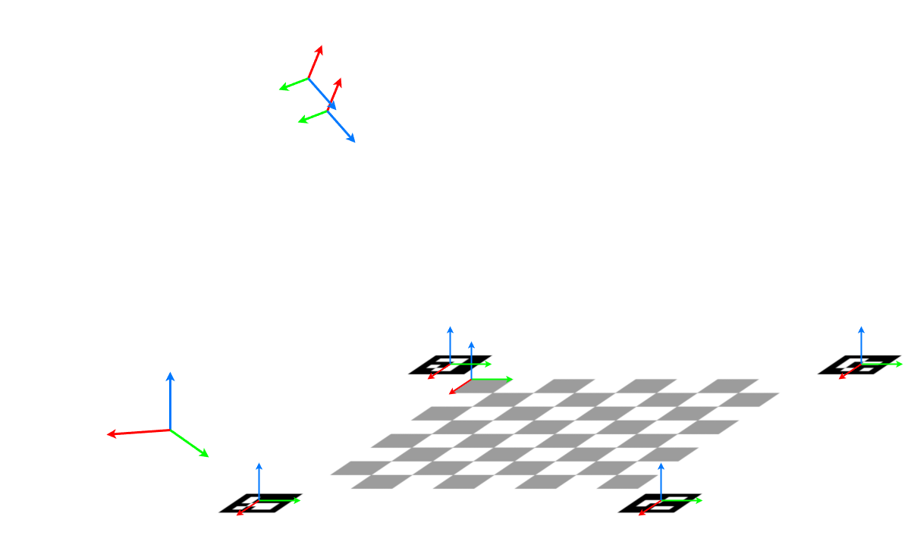

# Cobot Chess

Chess application for the **CORA cobot arm**.  
The system uses **monocular computer vision** to estimate rigid-body transforms in
${\mathrm{SE}(3) ${between the robot, camera, fiducial markers, and a physical chessboard.
A **CNN-based chess engine** selects moves, which are executed via pick-and-place
motions using the robot’s Ethernet SDK.

Each agent is trained and biased toward the move distribution of a single human
player.

---

## Project Structure

    assets/
    chess/
    tfs/
    vision/
    main.py
    tests/
    pyproject.toml
    requirements.txt

---

## Installation

### Clone the Repository

    git clone <url> <your-directory>
    cd <your-directory>

### Install Dependencies

    pip install -r requirements.txt

---

## Dependencies

- `numpy`
- `chess`
- `codi` (networking SDK)
- `torch`
- `pandas`
- `seaborn`

All dependencies are installed automatically when using `requirements.txt`.

---

## Vision and Perception

This section describes the perception pipeline for estimating camera pose,
board pose, and opponent moves using rigid-body transforms in
${\mathrm{SE}(3) }$.

---

## Camera Calibration

    from vision import camera_calibration

    # Use camera 0 with a checkerboard pattern
    camera_calibration(0, use_checkerboard=True)

---

## Marker Placement

---

## Coordinate Frames

We define the following coordinate frames:

### Robot Frames
- ${\mathcal{F}_W }$: World (robot base) frame  
- ${\mathcal{F}_C}$ : Camera frame  
- ${\mathcal{F}_G}$ : Gripper (end-effector) frame  

### Environment Frames
- ${\mathcal{F}_{M_i}, i \in \{1,2,3,4\}}$: Fiducial marker frames  
- ${\mathcal{F}_{B}}$: Chessboard origin frame  

---

## SE(3) Transform Notation

A rigid-body transform from frame ${\mathcal{F}_A }$ to ${\mathcal{F}_B }$ is written as

$${
    ^WT_{B_O} = \begin{bmatrix} {^WR_{B_O}} & {^W\vec{r}_{B_O}} \\\ 0 & 1 \end{bmatrix} = {^WT_{C}} {^CT_{B_O}} 
    \\[1em] {^CT_{B_O}} = {^CT_{M_i}} \space {^{M_i}T_{B_O}} \qquad 1 \le i \le 4 
    \\[1em] 
}$$

where  
${{}^{A}\mathbf{R}_{B} \in \mathrm{SO}(3) }$ is a rotation matrix and  
${{}^{A}\mathbf{p}_{B} \in \mathbb{R}^3 }$ is a translation vector.

---

## Transform Chain

The pose of the chessboard in the world frame is obtained via composition in
${\mathrm{SE}(3)}$:

${{}^{W}\mathbf{T}_{B}={}^{W}\mathbf{T}_{C}\,{}^{C}\mathbf{T}_{B}.}$

The camera-to-board transform is computed from the detected fiducial markers:

$${
    {}^{C}\mathbf{T}_{B}={}^{C}\mathbf{T}_{M_i}\,{}^{M_i}\mathbf{T}_{B},\qquad i \in \{1,2,3,4\}.
}$$

---

## Board Origin Offset

The chessboard origin is defined relative to marker ${M_1 }$ by a fixed translation

$$${
    {}^{M_1}\mathbf{p}_{B}=\begin{bmatrix}t \\ t \\ 0 \end{bmatrix},
}$$

yielding the homogeneous transform

$${
    {}^{M_1}\mathbf{T}_{B}=\begin{bmatrix} \mathbf{I}_{3 \times 3} & \begin{bmatrix} t \\ t \\ 0 \end{bmatrix} \\ \mathbf{0}^{\mathsf{T}} & 1 \end{bmatrix}.
}$$

---

## Basic Usage

    python main.py

The system will:

1. Detect fiducial markers and the chessboard
2. Estimate all required ${\mathrm{SE}(3) }$ transforms
3. Observe the opponent’s move
4. Select a move using the CNN-based engine
5. Execute the move using the robot arm

---

## Playing a Match

Ensure that:

- The camera is calibrated
- All fiducial markers are visible
- The chessboard lies within the robot’s reachable workspace

Once running, the robot alternates turns with the human opponent and physically
moves the chess pieces on the board.

