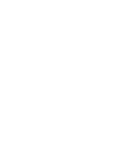
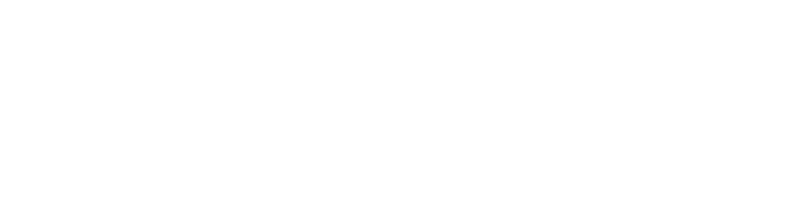
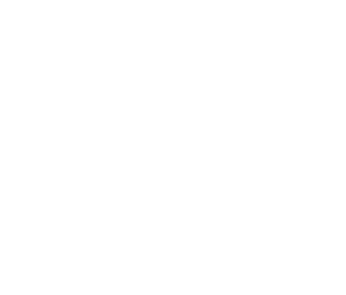

## Transforms  

## Coordinate Frames

#### Robot Frames
-  World (robot base) frame  
-  Camera frame  
-  Gripper (end-effector) frame  

#### Environment Frames
-  Fiducial marker frames  
-  Chessboard origin frame  

---

## Transform Chains

#### Camera to Board Origin

The pose of the chessboard in the world frame is obtained via composition in $\mathrm{SE}(3)$:

The camera-to-board transform is computed from the detected fiducial markers:

---

#### Marker Offset

The chessboard origin is defined relative to marker $M_1$ by a fixed translation:

yielding the homogeneous transform:

